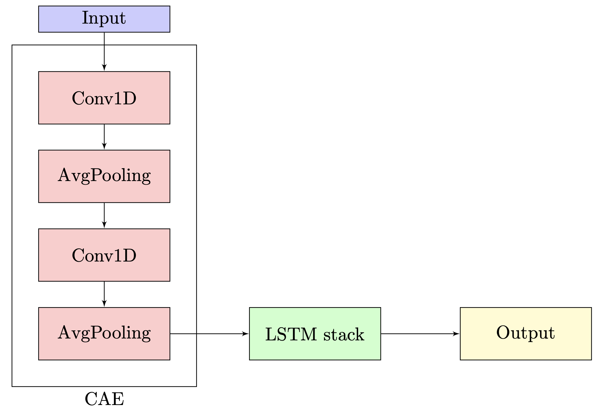
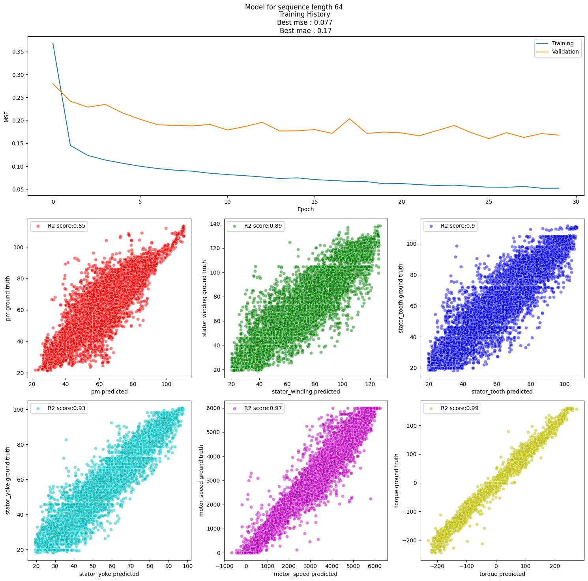

# RNN for heat loss prediction

#### This project is part of my Vector Institute (https://vectorinstitute.ai/) certification in Machine Learning

## Using LSTM recurrent neural network to predict electric motor temperature

Using the Kaggle data (https://www.kaggle.com/datasets/wkirgsn/electric-motor-temperature) on a Permanent Magnet Synchronous Motor (PMSM), a Recurrent Neural Network (RNN) is trained to predict the temperature of various PMSM parts (rotor, stator parts) and its physical behaviour induced by actuators (speed, torque). 

  

The RNN uses 8 Long-Short Time Memory (LSTM) layers with 32 units each, preceded by an Convolutional Autoencoder (CAE) for denoising. The CAE has 2 Convolution layers, each followed by a Max Pooling layer, and two Transpose Convolution layers. Each Conv / ConvTranspose layer has 64 filter. The total number of trainable parameters is ~120k, which is ~10% of the training data. 

The length of the input sequence (the time series window) is an adjustable hyperparameter that has to be chosen in advance. The notebook studies the values of 16, 32, 64, and 128. The goodness-of-fit (= the R2 coefficient) increases up to 0.85 (rotor temperature) to 0.99 (torque). At the reading frequency of 2 Hz (as per the dataset description) it allows to make predictions from every 8 seconds with lower accuracy to ~ every 30 seconds with higher accuracy, after which the prediction accuracy drops. 

  

There are also pre-trained model available as .h5 files. As you may need GPU support to run the notebook fast, the other option is to load a saved model.
